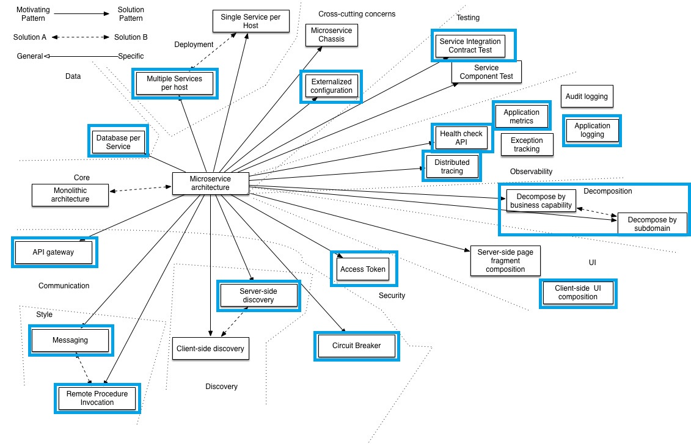

# Chapter 01 - Introduction, assumptions, tooling and pre-requisites

- [Chapter 01 - Introduction, assumptions, tooling and pre-requisites](#chapter-01---introduction-assumptions-tooling-and-pre-requisites)
  - [Background - Cloud Native and the 12-Factor Application](#background---cloud-native-and-the-12-factor-application)
  - [Microservices Architecture](#microservices-architecture)
  - [Operating Environment & Tooling](#operating-environment--tooling)

## Background - Cloud Native and the 12-Factor Application

Kubernetes is a popular and powerful orchestration platform that has matured a lot over the past couple of years.

The platform is ideally suited for applications written in alignment with the [12-factor application principles](https://12factor.net/). The table below is a summary of the 12-factors as per the website as on 5 July 2021:

| Factor # | Name                                                          | Brief Description                                                |
|:--------:|---------------------------------------------------------------|------------------------------------------------------------------|
|    01    | [Codebase](https://12factor.net/codebase)                     | One codebase tracked in revision control, many deploys           |
|    02    | [Dependencies](https://12factor.net/dependencies)             | Explicitly declare and isolate dependencies                      |
|    03    | [Configuration](https://12factor.net/config)                  | Store config in the environment                                  |
|    04    | [Backing services](https://12factor.net/backing-services)     | Treat backing services as attached resources                     |
|    05    | [Build, release, run](https://12factor.net/build-release-run) | Strictly separate build and run stages                           |
|    06    | [Processes](https://12factor.net/processes)                   | Execute the app as one or more stateless processes               |
|    07    | [Port binding](https://12factor.net/port-binding)             | Export services via port binding                                 |
|    08    | [Concurrency](https://12factor.net/concurrency)               | Scale out via the process model                                  |
|    09    | [Disposability](https://12factor.net/disposability)           | Maximize robustness with fast startup and graceful shutdown      |
|    10    | [Dev/Prod Parity](https://12factor.net/dev-prod-parity)       | Keep development, staging, and production as similar as possible |
|    11    | [Logs](https://12factor.net/logs)                             | Treat logs as event streams                                      |
|    12    | [Admin processes](https://12factor.net/admin-processes)       | Run admin/management tasks as one-off processes                  |

Further reading on _*Cloud Native*_ development and 12-factor applications:

* [Defining Cloud Native](https://docs.microsoft.com/en-us/dotnet/architecture/cloud-native/definition) - another very good introduction from Microsoft, which include 3 additional factors from a Microsoft perspective, namely _API First_, _Telemetry_ and _Authentication & Authorization_.
* [12 Factor App Principles and Cloud-Native Microservices](https://dzone.com/articles/12-factor-app-principles-and-cloud-native-microser) - A solid one-pager introduction from DZone
* [An illustrated guide to 12 Factor Apps](https://www.redhat.com/architect/12-factor-app) from Red Hat
* [What about Cloud-Native applications?](https://docs.microsoft.com/en-us/dotnet/architecture/modernize-with-azure-containers/modernize-existing-apps-to-cloud-optimized/what-about-cloud-native-applications) Another Microsoft resource from a .Net development perspective, targeting MS Azure

## Microservices Architecture

Aligning your application development to the 12-factor application principles is a great start to prepare your application for microservices deployment. 

However, microservices architecture is a much broader concept that encapsulates a number of patterns and best-practices. There is [a great resource](https://microservices.io/patterns/microservices.html) available online that provides a good single page introduction as well as a introduction to the primary patterns in Microservices Architecture.

The following image highlight the most important patterns that this resource will focus on:

Other patterns and best-practices will be dealt with in the relevant chapters.

## Operating Environment & Tooling

All examples was developed and test on a single [Dell g3 Gaming Laptop](https://www.dell.com/za/p/g-series-15-3579-laptop/pd), with 4-core (8 threads) Intel i5 chip-set and with 32GiB of RAM.

The above laptop run Ubuntu 20.04 LTS.

The following software packages was installed using the Ubuntu package manager:

* Visual Studio Code
* OpenJDK (11 and 16)
* Python 3
* Docker
* Multipass
* Git

The target Kubernetes environment will run on a 3-node Multipass virtual environment, based on [K3s](https://k3s.io/). Full instructions on preparing and installing this environment will be covered in [chapter 04](../chapter_04/README.md)

In terms of shell, all examples was run on [zsh](https://www.zsh.org/) with the excellent [Oh My Zsh](https://ohmyz.sh/) environment for managing ZSH.

