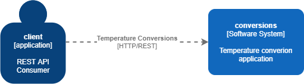
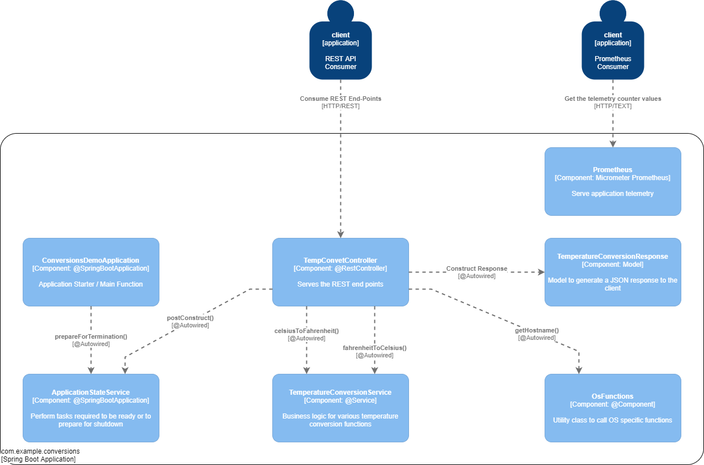

# Our Spring Boot Application - Design & Implementation Notes

- [Our Spring Boot Application - Design & Implementation Notes](#our-spring-boot-application---design--implementation-notes)
  - [Project Structure](#project-structure)
  - [Design Diagrams](#design-diagrams)
    - [Application State](#application-state)
    - [Temperature Conversion Service](#temperature-conversion-service)
    - [Operating System Functions](#operating-system-functions)
    - [The Response Model](#the-response-model)
    - [The REST Controller](#the-rest-controller)
    - [Prometheus Telemetry](#prometheus-telemetry)

## Project Structure 

From the `chapter_03/project_source_code/conversions` directory, relative to the project ROOT directory, the following project tree can be observed:

```text
src/main
├── java
│   └── com
│       └── example
│           └── conversions
│               ├── controllers
│               │   └── TempConvetController.java
│               ├── ConversionsDemoApplication.java
│               ├── models
│               │   └── TemperatureConversionResponse.java
│               ├── services
│               │   ├── ApplicationStateService.java
│               │   ├── TemperatureConversionServiceImpl.java
│               │   └── TemperatureConversionService.java
│               └── utils
│                   └── OsFunctions.java
└── resources
    ├── application.properties
    ├── static
    └── templates
```

## Design Diagrams

The [C4 model annotation](https://c4model.com/) can be used to better understand how the application was designed and implemented.

The context of the application is very simple as it has no external dependencies at this stage:



We see a consumer that will call two REST API end-points that can do either a Celsius to Fahrenheit conversion or vice versa.

Looking at a more detailed component diagram, we see all the major parts of the application:



### Application State

We are working toward a more complex example, and it may be a good idea also to start thinking about standard patterns that should be present in any microservices type application. One such concept to consider is to have a mechanism for the application to ensure it is started properly and when we shutdown we ensure all requests in-flight is served before completely shutting down. For this purpose, the `ApplicationStateService` is introduced to manage the overall readiness state of our application. This will become even more relevant in future projects as we introduce probes likes `readiness` and `liveness`.

### Temperature Conversion Service

This service contains the basic business logic for our application. For such a simple example we could just as well have computed the temperature conversion in the controller (it's a one-liner calculation after all), but we do plan to add more features and more complex secondary processes in the future, so it is a good idea to define these separate services now already.

### Operating System Functions

For our logging, we want to include the hostname we are running on. This will also become more relevant in future iterations where we run multiple instances of the service and we want to know which service responded to which query. In this design, we keep these function separate from the rest of the application as they serve only to support the application and do not form a core or critical part of the overall application.

### The Response Model

The response for temperature conversions will be in the form of a JSON object, and for this reason we need to define the model formally. Spring will automatically convert the model to an appropriate JSON response.

### The REST Controller

The REST controller follow a very familiar Spring Boot pattern for REST controllers and two end-points are exposed at this point in time. Both end points only accept HTTP GET requests and the source temperature is supplied as a path parameter value which will be converted to a Java `Double` type before the actual conversion is done. Minimal error handling is done at this stage and Spring will handle any exceptions as a standard HTTP error response to the client.

### Prometheus Telemetry

Included in the project is a fairly standard Spring Boot implementation for exposing telemetry data to Prometheus. Nothing special is done at this stage and more time will be spend in future chapters around telemetry.
