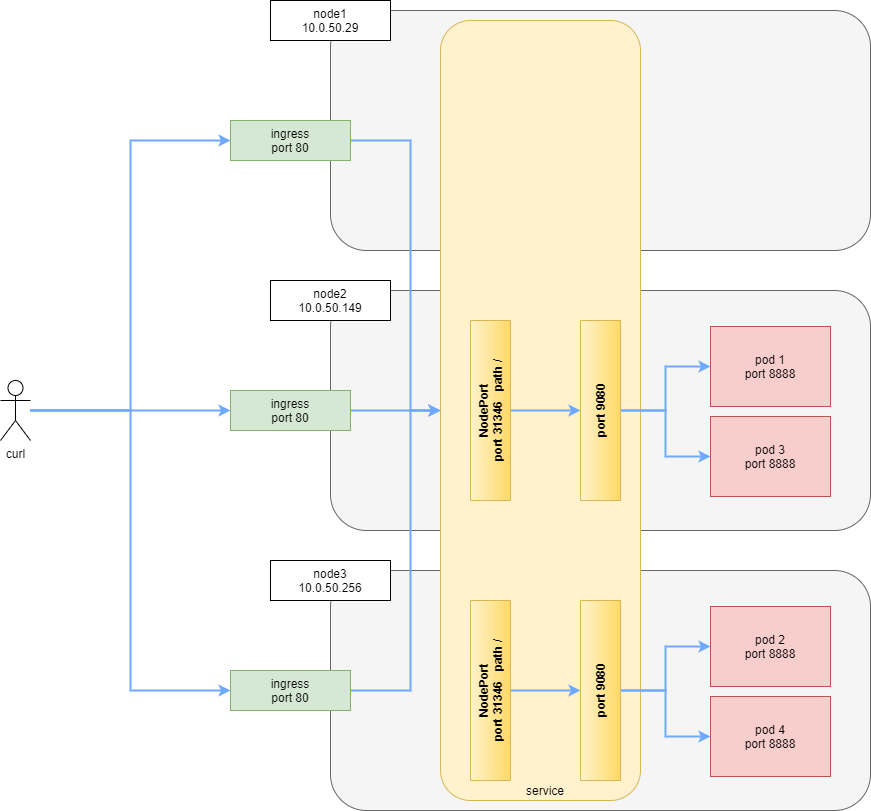

# Chapter 05 - Taking a basic 12-factor application to a Kubernetes cluster

- [Chapter 05 - Taking a basic 12-factor application to a Kubernetes cluster](#chapter-05---taking-a-basic-12-factor-application-to-a-kubernetes-cluster)
  - [Goals of this chapter](#goals-of-this-chapter)
  - [More tools - tmux](#more-tools---tmux)
  - [Preparing the application](#preparing-the-application)
  - [Preparing and applying our deployment](#preparing-and-applying-our-deployment)
  - [Testing](#testing)
    - [Deployment Verification](#deployment-verification)
    - [Application Functional Testing](#application-functional-testing)
    - [Looking at the logs](#looking-at-the-logs)
  - [Cleaning Up](#cleaning-up)
  - [References and Further Reading](#references-and-further-reading)

## Goals of this chapter

In this chapter will take a copy of our project from [chapter 03](../chapter_03/README.md) and adapt it for deployment in our kubernetes cluster we created in [chapter 04](../chapter_04/README.md)

The changes in the source code include the following:

* Added `liveness` and `readiness` end points to our application (refer to the "_[Configure Liveness, Readiness and Startup Probes](https://kubernetes.io/docs/tasks/configure-pod-container/configure-liveness-readiness-startup-probes/)_" documentation for kubernetes)
* Created our deployment yaml file in order to deploy our application in the cluster

We will then experiment a little with long startup times and terminate times to see how kubernetes manage those instances

## More tools - tmux

At this point I would also like to suggest a `tmux` layout that is typically used for testing. 

```text
+------------------------------------+----------------------------------------+
|                                    |                                        |
|                                    |                                        |
|                                    |                                        |
|                pane 0              |                  pane 1                |
|                                    |                                        |
|                                    |                                        |
+------------------------------------+----------------------------------------|
|                                                                             |
|                                pane 2                                       |
|                                                                             |
+-----------------------------------------------------------------------------+
```

<a href="https://github.com/nicc777/kubernetes-from-scratch/raw/main/chapter_05/tmux_session.png" target="_blank"></a>

I get this layout by starting `tmux` and then first split horizontally (`CTRL+B` and then `SHIFT+"`).

Next, make sure you are on the top pane. If you press keys and it appears on the bottom pane, press `CTRL+B` and then press just the `UP_ARROW`.

Now, split the upper pane vertically with `CTRL+B` and then `SHIFT+%`.

The pane numbers above I got by pressing `CTRL+B` and then `q`. Your layout may be different, but for reference I will use the top layout.

Typically I use the panes for the following:

* Pane 0 - Where I run things like `watch curl ....` when testing endpoints.
* Pane 1 - Where I usually run `watch kubectl get all` within a certain namespace, just to see what is happening inside your namespace
* Pane 2 - Where I run things like `kubectl apply ...` and then I can see the effect on the other two panes.

The `tmux` tool is extremely handy as you can also save your session and completely disconnect. Later, when you log back into your remote system, you can restore the session and everything will still be running as you left it.

A nice cheat sheet I often reference [can be found here](https://tmuxcheatsheet.com/)

Right now, just ensure you run `export KUBECONFIG=$HOME/k3s.yaml` in each of these panes to ensure you reference the correct cluster.

## Preparing the application

You may want to refer back to [chapter 03](../chapter_03/README.md) if you unsure of what the following commands all do.

Basically we need to:

* Build the application to create a new `jar` file
* Build a local Docker image
* Push the new updated image to our Docker Hub project

If using `tmux` (which I assume), all the following commands are run from `pane 2`.

Assuming you start from the project ROOT directory, first run `cd chapter_05/project_source_code/conversions` to change into the application project directory.

No run:

```shell
./mvnw clean

./mvnw package

docker build -t conversions .

docker login

docker image tag conversions $DOCKER_HUB_USER/conversions:latest

docker image tag conversions $DOCKER_HUB_USER/conversions:v0.0.2

docker image push --all-tags $DOCKER_HUB_USER/conversions
```

## Preparing and applying our deployment

Now, ensure you are in the correct namespace:

```shell
kubectl config view -o jsonpath='{.contexts[].context.namespace}'
```

The output should be `pocs`.

In `pane 1`, run `watch -n1 kubectl get all`. You can switch back to `pane 2` when ready.

You can view the details of the deployment in the `conversions_k8s.yaml` file.

Now run the following command to deploy our application:

```shell
kubectl apply -f conversions_k8s.yaml
```

In `pane 1` you should see things starting to happen... It will take a minute or two for the image to download from DOcker Hub, depending of course on your Internet speed. On my system, it took just under 4 minutes for all pods to get to the `Running` state.

_*Important*_: If you did not edit the `conversions_k8s.yaml` file, you are actually using the image I created for this guide. This is not an issue at all. However, you can edit line 17 of the file to point to your own image in Docker Hub.

## Testing

### Deployment Verification

First, we need to find where our endpoints are listening:

```shell
kubectl describe ingress
```

Output:

```text
Name:             conversions-ingress
Namespace:        pocs
Address:          10.0.50.149,10.0.50.246,10.0.50.29
Default backend:  default-http-backend:80 (<error: endpoints "default-http-backend" not found>)
Rules:
  Host        Path  Backends
  ----        ----  --------
  *
              /   conversions-service:9080   10.42.1.8:8888,10.42.1.9:8888,10.42.2.10:8888 + 1 more...)
Annotations:  nginx.ingress.kubernetes.io/rewrite-target: /
Events:
  Type    Reason  Age                 From                      Message
  ----    ------  ----                ----                      -------
  Normal  Sync    11s (x8 over 3m1s)  nginx-ingress-controller  Scheduled for sync
```

Our service can be described by the command:

```shell
kubectl get service -o wide
```

Output:

```text
NAME                  TYPE       CLUSTER-IP      EXTERNAL-IP   PORT(S)          AGE    SELECTOR
conversions-service   NodePort   10.43.210.211   <none>        9080:31346/TCP   143m   app=conversions
```

We can also see how our pods have been distributed across the nodes:

```shell
kubectl get pods -o wide
```

Output:

```text
NAME                                      READY   STATUS    RESTARTS   AGE   IP           NODE    NOMINATED NODE   READINESS GATES
conversions-deployment-78bb955d57-m9nsx   1/1     Running   0          12m   10.42.2.9    node3   <none>           <none>
conversions-deployment-78bb955d57-w9t6l   1/1     Running   0          12m   10.42.1.9    node2   <none>           <none>
conversions-deployment-78bb955d57-wq6zs   1/1     Running   0          12m   10.42.1.8    node2   <none>           <none>
conversions-deployment-78bb955d57-k4m75   1/1     Running   0          12m   10.42.2.10   node3   <none>           <none>
```

To see all of this in a diagram, you could form the following mental picture:



### Application Functional Testing

_*Note*_: We do not yet have an external load balancer set-up, but what we do have is an ingress service that listens on port 80 (HTTP) and 443 (HTTPS) on each node. Load balancing and certificate management is not in scope for this chapter, but it will hopefully be in a future chapter.

First, lets get all the node info:

```shell
kubectl get nodes -o wide
```

Output:

```text
NAME    STATUS   ROLES                  AGE   VERSION        INTERNAL-IP   EXTERNAL-IP   OS-IMAGE             KERNEL-VERSION     CONTAINER-RUNTIME
node1   Ready    control-plane,master   16h   v1.21.2+k3s1   10.0.50.103   <none>        Ubuntu 20.04.2 LTS   5.4.0-77-generic   containerd://1.4.4-k3s2
node2   Ready    <none>                 16h   v1.21.2+k3s1   10.0.50.199   <none>        Ubuntu 20.04.2 LTS   5.4.0-77-generic   containerd://1.4.4-k3s2
node3   Ready    <none>                 16h   v1.21.2+k3s1   10.0.50.61    <none>        Ubuntu 20.04.2 LTS   5.4.0-77-generic   containerd://1.4.4-k3s2
```

_*Note*_: For the following exercises, you need to be on a terminal session on the system where this cluster is running

The simplest test is to make a GET request to the `liveness` endpoint.

The IP address we connect to will be one of the three `INTERNAL-IP` addresses listed.

To determine the final path, lets have a look at the configuration again:

```yaml
apiVersion: networking.k8s.io/v1
kind: Ingress
metadata:
  name: conversions-ingress
  annotations:
    nginx.ingress.kubernetes.io/rewrite-target: /
spec:
  rules:
  - http:
      paths:
      - path: /
        pathType: Prefix
        backend:
          service:
            name: conversions-service
            port:
              number: 9080
```

Everything on the root path (`/`) will be proxied to the `conversions-service`.

Our controller has the following class definition and annotations:

```java
@RestController
@RequestMapping("/api")
@Slf4j
public class TempConvetController {

   ...... 

    @GetMapping("/liveness")
    public String liveness() {
        log.info("[" + osFunctions.getHostname() + "] liveness() called");
        return "ok";
    }

   ......

}
```

From the above, we see the base path is bound to `/api` and the liveness end-point will therefore be on `/api/liveness`.

So, the full URL, picking node2 as a random node at this point, will be `http://10.0.50.199/api/liveness` and by using `curl` we can test it as follow:

```shell
curl http://10.0.50.199/api/liveness
```

The output should be simply the string `ok`.

To test the actual functionality of our service, we can now proceed to request an actual temperature conversion:

```shell
curl http://10.0.50.199/api/convert/c-to-f/15
```

The output will be a JSON response looking something like the following:

```json
{"inputDegreesUnit":"celsius","inputDegrees":15.0,"convertedDegrees":59.0,"convertedDegreesUnit":"fahrenheit"}
```

### Looking at the logs

At this point you may wonder which pod responded to your request? You may even wonder if load balancing is working? 

This is where our logging can come in handy. In the controller, we are logging requests to the temperature conversion end-points with the following line of code:

```java
 log.info("[" + osFunctions.getHostname() + "] " + degrees + " celsius is " + degreesFahrenheit + " degrees fahrenheit");
```

The `osFunctions.getHostname()` call will effectively place the pod hostname in the log message.

The tricky part is that we have 4x pods running, as per our configuration which state `replicas: 4`, which is also verified by the command `kubectl get pods`.

Therefore, to get the logs from all the pods, you need to run the following command, which excludes lines with the word `called` in, as we are also logging the requests to the `liveness` and `readiness` end points which is done every couple of seconds:

```shell
kubectl logs -f -l app=conversions | grep -v called
```

Now, in another terminal window (or tmux pane), repeatedly run the request for a temperature conversion using the `curl` command. In the logs, you should see something like the following:

```text
2021-07-09 05:21:08.572  INFO 1 --- [nio-8888-exec-9] c.e.c.controllers.TempConvetController   : [conversions-deployment-d8c87f5cb-7b4jw] 15 celsius is 59.0 degrees fahrenheit
2021-07-09 05:21:11.645  INFO 1 --- [nio-8888-exec-7] c.e.c.controllers.TempConvetController   : [conversions-deployment-d8c87f5cb-qbpps] 15 celsius is 59.0 degrees fahrenheit
2021-07-09 05:21:13.036  INFO 1 --- [nio-8888-exec-7] c.e.c.controllers.TempConvetController   : [conversions-deployment-d8c87f5cb-4z2dq] 15 celsius is 59.0 degrees fahrenheit
2021-07-09 05:21:14.092  INFO 1 --- [nio-8888-exec-7] c.e.c.controllers.TempConvetController   : [conversions-deployment-d8c87f5cb-9gmnn] 15 celsius is 59.0 degrees fahrenheit
2021-07-09 05:21:15.531  INFO 1 --- [nio-8888-exec-1] c.e.c.controllers.TempConvetController   : [conversions-deployment-d8c87f5cb-7b4jw] 15 celsius is 59.0 degrees fahrenheit
2021-07-09 05:21:16.483  INFO 1 --- [nio-8888-exec-1] c.e.c.controllers.TempConvetController   : [conversions-deployment-d8c87f5cb-qbpps] 15 celsius is 59.0 degrees fahrenheit
```

As you can see, the load balancer appears to be working very nicely indeed!

## Cleaning Up

It might be a good idea to run the examples in this chapter a couple of times in order to gain a little more confidence and understanding as to how everything works. But to repeat the exercise, you must first delete all your previous deployments. You can do this by running the following command:

```shell
kubectl delete ingress conversions-ingress ; kubectl delete service conversions-service; kubectl delete deployment conversions-deployment; 
```

## References and Further Reading

There is a lot of information covered in this chapter in a highly summarized fashion, and the following resources may help you gain deeper understanding of the various topics, or even help you with troubleshooting:

* [kubectl Cheat Sheet](https://kubernetes.io/docs/reference/kubectl/cheatsheet/)
* Kubernetes [Monitoring, Logging, and Debugging](https://kubernetes.io/docs/tasks/debug-application-cluster/_print/)
* Kubernetes [Labels and Selectors](https://kubernetes.io/docs/concepts/overview/working-with-objects/labels/)
