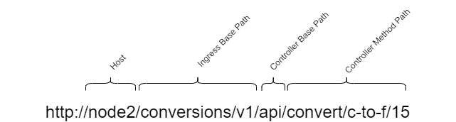

# Chapter 06 - External Load Balancer

- [Chapter 06 - External Load Balancer](#chapter-06---external-load-balancer)
  - [Background and Orientation](#background-and-orientation)
  - [Preparing for changes](#preparing-for-changes)
    - [Host Lookups](#host-lookups)
    - [Bind an Ingress Path to Each Service](#bind-an-ingress-path-to-each-service)
    - [Side Track: Environment Variables](#side-track-environment-variables)
    - [Applying Cluster Changes](#applying-cluster-changes)
  - [Choosing an External Load Balancer](#choosing-an-external-load-balancer)
    - [Getting and Running Kong](#getting-and-running-kong)

## Background and Orientation

In chapter 5 we got our application running, but unless you are on the host where the nodes are running, it is actually not yet possible to connect from the rest of the LAN to the nodes. 

If the nodes were on bare metal, you may be able to connect to each node, but it could still prove problematic in terms of handling failover or other scenarios where a particular node may go down.

The solution is to have an external load balancer that manages the load balancing of traffic to all the nodes.

To set this up, there are some more enhancement we need to do to our running service and also add a load balancer on our hosting system.

_*Note*_: In cloud deployment, for example Amazon AWS, an elastic load balancer would typically fulfill this role.

## Preparing for changes

The following changes need to be made for this exercise:

* Define the hosts for easier lookup (mimic a DNS-like experience).
* Enhance the Kubernetes ingress path logic

### Host Lookups

For host lookups, on the hosting system, we need to add the IP address for each node to the `/etc/hosts` file. First, obtain the addresses for the nodes by running the `kubectl get nodes -o wide` command. Your output should look something like this:

```text
NAME    STATUS   ROLES                  AGE   VERSION        INTERNAL-IP   EXTERNAL-IP   OS-IMAGE             KERNEL-VERSION     CONTAINER-RUNTIME
node3   Ready    <none>                 21h   v1.21.2+k3s1   10.0.50.61    <none>        Ubuntu 20.04.2 LTS   5.4.0-77-generic   containerd://1.4.4-k3s2
node1   Ready    control-plane,master   21h   v1.21.2+k3s1   10.0.50.103   <none>        Ubuntu 20.04.2 LTS   5.4.0-77-generic   containerd://1.4.4-k3s2
node2   Ready    <none>                 21h   v1.21.2+k3s1   10.0.50.199   <none>        Ubuntu 20.04.2 LTS   5.4.0-77-generic   containerd://1.4.4-k3s2
```

Each `INTERNAL-IP` IP address needs to be added to our  `/etc/hosts` file:

```shell
sudo sh -c 'echo "10.0.50.103 node1" >> /etc/hosts'

sudo sh -c 'echo "10.0.50.199 node2" >> /etc/hosts'

sudo sh -c 'echo "10.0.50.61 node3" >> /etc/hosts'
```

The output of `cat /etc/hosts` should look something like this:

```text
127.0.0.1       localhost
127.0.1.1       nicc777-G3-3779

# The following lines are desirable for IPv6 capable hosts
::1     ip6-localhost ip6-loopback
fe00::0 ip6-localnet
ff00::0 ip6-mcastprefix
ff02::1 ip6-allnodes
ff02::2 ip6-allrouters
10.0.50.61 node3
10.0.50.103 node1
10.0.50.199 node2
```

On the local host, we can now reference the nodes by name, for example:

```shell
curl http://node2/api/convert/c-to-f/15
```

Later, when the cluster is re-created or when the IP addresses change for some reason, we only have to update our `/etc/hosts` file and everything else should work fine. 

_*Note*_: Proper DNS is the preferred way to deal with this in a production setting.

### Bind an Ingress Path to Each Service

Finally, we use a slightly different configuration where we will add the path `/conversions/v1`, as the base bath for this service. There are also some other small changes in the `conversions_k8s.yaml` file, so feel free to compare the file in this chapter with the file we used in chapter 06. In fact, we also renamed it for this chapter to `conversions-v1_k8s.yaml`.

The primary change, as you may see, is that we now introduce the notion of versions to our applications. This means that in the near future we may be able to run a second version side by side to our first version. This is done in to support any other consumers of the service to update in a more convenient time frame while we can run multiple versions of the same service.

In this implementation we will follow a strategy of path based versioning. 

At this point we should also probably mention [semantic versioning](https://semver.org/). In this approach, any breaking changes to the API (interface changes), will require a new `major` version (from v1 to v2 for example), and in our path versioning the major version is therefore used to expose new major versions of the same service. Minor and patch version updates must never break compatibility and is only meant to enhance or implement bug fixes to the code base without affecting any other interface or contract. In a near future chapter we will also start to align our source versioning in out `pom.xml` to align with our Kubernetes manifest file.

Further reading:

* [How to design and version APIs for microservices (part 6)](https://www.ibm.com/cloud/blog/rapidly-developing-applications-part-6-exposing-and-versioning-apis) (IBM Article)
* [Versioning an API](https://cloud.google.com/endpoints/docs/openapi/versioning-an-api) - A Google cloud article, in which we follow the strategy for supporting `Backwards-incompatible changes`

### Side Track: Environment Variables

On a slightly unrelated note to the rest of this chapter, I need to through in a note about environment variables, which was also added to the new deployment manifest.

In Spring Boot, we can use environment variables to set properties for our application. For example, the environment variable `SERVICE_READY_WAITTIME` will be converted to `service.ready.waittime` and the value, which is required to be a string in our Yaml configuration, will be converted automatically to an `Integer` byt the Spring framework.

This approach addresses the `Configuration` principle of [the 12-factor application](https://12factor.net/config) by _storing the configuration in the environment_. This allows for great flexibility especially as our needs change from a development to eventually a production environment.

In a way, it also addresses the [separate build, release, run](https://12factor.net/build-release-run) principle, by separating our configuration completely from the build process and allows us to dynamically inject the appropriate configuration during deployment in an environment of our choosing.

Further reading:

* [Define an environment variable for a container](https://kubernetes.io/docs/tasks/inject-data-application/define-environment-variable-container/)
* [Externalized Configuration in Spring Boot](https://docs.spring.io/spring-boot/docs/1.5.6.RELEASE/reference/html/boot-features-external-config.html)

### Applying Cluster Changes

To ensure we start of a clean slate, we will first delete our current service:

```shell
kubectl delete ingress conversions-ingress ; kubectl delete service conversions-service; kubectl delete deployment conversions-deployment; 
```

Wait until all resources are gone. When running `kubectl get all` youu should get the output `No resources found in pocs namespace.`.

Next, ensure you are in the project ROOT folder and then change into the `chapter_06` directory:

```shell
cd chapter_06
```

Now, apply the new configuration:

```shell
kubectl apply -f conversions-v1_k8s.yaml
```

Let's see how our ingress configuration looks like by running `kubectl describe ingress`. You should expect output along the lines of the following:

```text
Name:             conversions-ingress-v1
Namespace:        pocs
Address:          10.0.50.103,10.0.50.199,10.0.50.61
Default backend:  default-http-backend:80 (<error: endpoints "default-http-backend" not found>)
Rules:
  Host        Path  Backends
  ----        ----  --------
  *
              /conversions/v1   conversions-service-v1:9080   10.42.1.16:8888,10.42.1.17:8888,10.42.2.14:8888 + 1 more...)
Annotations:  nginx.ingress.kubernetes.io/rewrite-target: /
Events:
  Type    Reason  Age                From                      Message
  ----    ------  ----               ----                      -------
  Normal  Sync    30s (x4 over 52s)  nginx-ingress-controller  Scheduled for sync
```

That means that we need to add the base path `/conversions/v1` to our `curl` request when we test:

```shell
curl http://node2/conversions/v1/api/convert/c-to-f/15
```




## Choosing an External Load Balancer

When choosing tooling for our Kubernetes cluster, it may be a very good idea to refer to a trusted party like the [Cloud Native Compute Foundation](https://www.cncf.io/). There is a huge collections of tools, Open Source and Commercial, that you can choose to use.

Everyone has their favorite, and each individual tool has it's pros and cons. 

The Load Balancer I choose for this project is [Kong](https://konghq.com/kong/) which is Cloud Native focused and [a member of the CNCF](https://www.cncf.io/announcements/2019/05/21/cloud-native-computing-foundation-announces-kong-inc-as-gold-member/) since May 2019.

More specifically, Kong will be deployed in the role of an API Gateway, which also will satisfy our requirement for a load balancer.

_*Note*_: In a public cloud environment like AWS, you may consider using [AWS API Gateway](https://aws.amazon.com/api-gateway/) together with an [AWS Elastic Load Balancer](https://aws.amazon.com/elasticloadbalancing/) to your [AWS EKS Cluster](https://aws.amazon.com/eks/) - other commercial public cloud providers have similar services.

Further reading:

* [Integrate Amazon API Gateway with Amazon EKS](https://aws.amazon.com/blogs/containers/integrate-amazon-api-gateway-with-amazon-eks/)

### Getting and Running Kong

For this part, you should be in a terminal window in your home directory. Just to make sure, run the command `cd $HOME`.

_*Note*_: I initially tried the Docker version of Kong, but ran into network routing issues that made the setup for this guide too complex and unnecessary. I will therefore show the installation steps for Ubuntu. Please [consult the documentation](https://konghq.com/install/) to install Kong on your system, should you use something different than Ubuntu.

The following command will fetch the Kong package:

```shell
curl -Lo kong.2.4.1.amd64.deb "https://download.konghq.com/gateway-2.x-ubuntu-$(lsb_release -cs)/pool/all/k/kong/kong_2.4.1_amd64.deb"
```

Then install it with:

```shell
sudo dpkg -i kong.2.4.1.amd64.deb
```

We won't be using a DB, so start Kong config process with the following commands:

```shell
sudo cp -vf /etc/kong/kong.conf.default /etc/kong/kong.conf

kong config init
```

This will create a `kong.yml` file. But we first need to edit `/etc/kong/kong.conf`. Add the following two lines under the `DATASTORE` section.

```text
database = off
declarative_config = /home/nicc777/git/Personal_Repos/GitHub/kubernetes-from-scratch/chapter_06/kong_MODIFIED.yml
```

Now, start Kong with the command:

```shell
sudo kong start
```

TODO - work in progress
