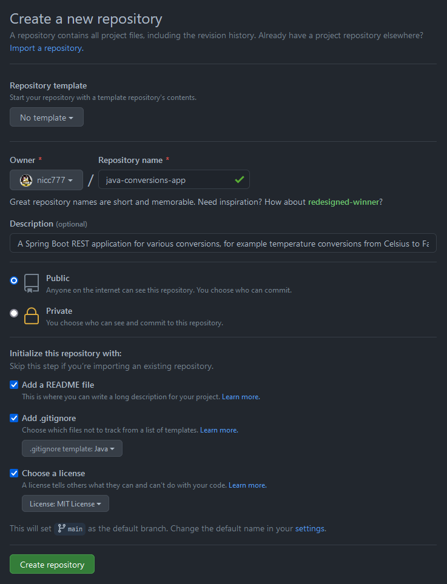

# Chapter 07 - Source Control and Automated Build (Continuous Integration) with GitHub and GitHub Actions

- [Chapter 07 - Source Control and Automated Build (Continuous Integration) with GitHub and GitHub Actions](#chapter-07---source-control-and-automated-build-continuous-integration-with-github-and-github-actions)
  - [Objectives of This Chapter](#objectives-of-this-chapter)
  - [Setup a GitHub Repository](#setup-a-github-repository)
  - [Required Reading](#required-reading)
  - [Configured Actions](#configured-actions)
  - [Triggering Release Actions](#triggering-release-actions)
  - [Using the Docker Image from the GitHub Container Registry](#using-the-docker-image-from-the-github-container-registry)
  - [Unit Tests](#unit-tests)
    - [Example Scenario: Updating our paths break unit tests](#example-scenario-updating-our-paths-break-unit-tests)
  - [Security Scanning and DevSecOps](#security-scanning-and-devsecops)
  - [Conclusion](#conclusion)

## Objectives of This Chapter

With the focus on 12-factor application development as well as taking into account the concepts around DevOps, this chapter will focus on GitHub and the services available to create a Java Spring Boot Project in GitHub and use GitHub actions to automate the build process in order to create artifacts such as a Maven repository with our builds and a container registry with our prepared Docker image.

Therefore, the primary objectives can be listed as:

* Creating a GitHub Project
* Create our application and configure various elements
* Setting up actions to build the application:
  * Save our build artifact in a GitHub Maven repository
  * Build and push our application Docker image to the GitHub container registry

Secondary objectives will include the following aspects:

* Develop unit tests that must pass a certain percentage in order for a build to succeed
* Discuss options around security scanning of our source code repository and artifacts

Further reading that may be helpful for this chapter:

* [What is DevOps? A guide to common methods and misconceptions](https://github.blog/2020-10-07-devops-definition/)
* [Getting started with DevOps automation](https://github.blog/2020-10-29-getting-started-with-devops-automation/)
* [DevOps development: top seven tips for faster application development](https://resources.github.com/whitepapers/Seven-Tips-for-Faster-Development/)

## Setup a GitHub Repository

I have created a demonstration project on GitHub called [java-conversions-app](https://github.com/nicc777/java-conversions-app). This project is used mainly to demonstrate all the features and discussion points of this chapter.

Below is a screenshot of how I created the project. You can either choose to attempt to do this from scratch, or you can just fork this project in order to have a copy available on your own account.



On your development system, you now need to clone the newly created repository. Refer to the [GitHub documentation](https://docs.github.com/en/github/creating-cloning-and-archiving-repositories/cloning-a-repository-from-github/cloning-a-repository) for more detailed instructions on how to accomplish this task.

_*Note*_: As chapters of this guide progress, the content of the repository may be changing. This chapter deals with the basics of getting the project started and the examples from file contents shown reflect the state in the initial setup of this repository. However, should you fork the repository, all the concepts refereed to in this chapter should still be relevant and working.

## Required Reading

At this stage, just before we delve into the detail, it is important that you are familiar with the content of the following GitHub documentation resources:

* [Introduction to GitHub Actions](https://docs.github.com/en/actions/learn-github-actions/introduction-to-github-actions)
* [About permissions for GitHub Packages](https://docs.github.com/en/packages/learn-github-packages/about-permissions-for-github-packages)
* [Configuring a package's access control and visibility](https://docs.github.com/en/packages/learn-github-packages/configuring-a-packages-access-control-and-visibility)
* [Authentication in a workflow](https://docs.github.com/en/actions/reference/authentication-in-a-workflow)
* [Encrypted secrets](https://docs.github.com/en/actions/reference/encrypted-secrets)
* [Storing workflow data as artifacts](https://docs.github.com/en/actions/guides/storing-workflow-data-as-artifacts)
* [Working with the Apache Maven registry](https://docs.github.com/en/packages/working-with-a-github-packages-registry/working-with-the-apache-maven-registry)
* [Publishing Java packages with Maven](https://docs.github.com/en/actions/guides/publishing-java-packages-with-maven)
* [Viewing packages](https://docs.github.com/en/packages/learn-github-packages/viewing-packages)
* Specific Actions:
  * [setup-java](https://github.com/actions/setup-java)
  * [Upload-Artifact v2](https://github.com/actions/upload-artifact)
  * [GitHub Action - Releases API](https://github.com/actions/create-release)
  * [Docker / login-action](https://github.com/docker/login-action)
  * [Docker / meatadata-action](https://github.com/docker/metadata-action)
  * [Docker / build-push-action](https://github.com/docker/build-push-action)

## Configured Actions

All actions are located in the `.github/workflows` directory of the [java-conversions-app](https://github.com/nicc777/java-conversions-app) repository (or your forked repository).

The actions are configured with the following triggers:

* On every `push`:
  * Run the `Java CI` workflow (defined in `.github/workflows/build-project.yml`) which creates an artifact file that will be available for 5 days
* On very creation of a tag in the format `v*` (i.e. `v1.0.0`):
  * Run the `Upload Release Asset` workflow (defined in `.github/workflows/create-release.yml`) which will create a new release and publish a new Maven package as well as push a new Docker image to the GitHub container registry

## Triggering Release Actions

Assuming your new version number is in the environment variable `$VERSION`, and you are on the `main` branch on your development system, we trigger release actions by running the following commands (`$VERSION` must start with `v`, for example `v1.0.7`):

```shell
git tag -a $VERSION -m "Workflow test for version ${VERSION}"

git push origin --tags
```

If you need to list all your tags, just run `git tag -l`.

## Using the Docker Image from the GitHub Container Registry

One the workflow has run, especially on a new release, you should have a Docker image available.

Using the example from my GitHub repository, you can test it with the following command (adjust to your own account if you were able to fork this repo and trigger your own workflows):

```shell
docker pull ghcr.io/nicc777/java-conversions-app:latest

docker run --name conversions-app -p 8888:8888 ghcr.io/nicc777/java-conversions-app:latest
```

You should see the familiar spring boot logo as the application starts up. You can test as per the examples from `chapter 03`.

## Unit Tests

The topic of unit tests can invoke strong emotions among many developers. For this guide, I will just state simply that it is always a good idea to add unit tests to all your projects. The exact details of unit tests, and what is acceptable, should be up to each development team to decide. 

Ultimately, the goal of unit testing is to discover obvious errors before the application is released. Therefore, in an automated build pipeline, the pipeline should stop when unit tests are failing.

### Example Scenario: Updating our paths break unit tests

Refer to the following commit history for some reference:

<a href="https://github.com/nicc777/kubernetes-from-scratch/raw/main/chapter_07/commit_history.png" target="_blank"></a>

Unit tests for our controller was added in commit `5d8548ac`. 

In commit `4a13cc41` of the demonstration project, the base path of the controller was updated.

This kicked of an automated build which ultimately failed. The following screenshots from GitHub shows the failed build, including some information available in the log:

<a href="https://github.com/nicc777/kubernetes-from-scratch/raw/main/chapter_07/build_fail_01.png" target="_blank"></a>

<a href="https://github.com/nicc777/kubernetes-from-scratch/raw/main/chapter_07/build_fail_02.png" target="_blank"></a>

<a href="https://github.com/nicc777/kubernetes-from-scratch/raw/main/chapter_07/build_fail_03.png" target="_blank"></a>

Finally, the unit test results as seen in the VSCode IDE:

<a href="https://github.com/nicc777/kubernetes-from-scratch/raw/main/chapter_07/build_fail_04.png" target="_blank"></a>

The unit tests was ultimately updated with the new path, and the final result is available to vie under release tag `v1.1.1`. 

_*Note*_: It is therefore also advisable to run unit tests on your development system (local workstation) before committing to the remote repository that will kick off a build. Keep in mind that each build in a service like GitHub will eat away at your quota. Therefore, making sure that quality starts in the IDE can end-up saving you or your company some money. For the individual programmer working on a hobby project, it could mean the difference between staying on the free tier vs going to a paid subscription.

## Security Scanning and DevSecOps

An even more technical and emotional discussion among many professionals is around security scanning of your code. Again, for the purpose of this guide, each team should agree on their own approach that is also acceptable to the relevant security specialists within the organization. Some organizations, like banks, will have (or at least, "should" have) very strict security scanning rules build into their automated build pipelines. Personal or hobby projects on the other hand just need a tool to provide some level of comfort that the basics are covered and that there are no obvious issues that require attention.

It is not only about the actual code of the project - its also about any third party dependencies, or external libraries, that your project depends on. In the Docker/Kubernetes world there is also the matter of the container image, the base operating system of that image together with all other installed software.

Luckily, at least as of mid-2021, there are a lot of really good security tools available that can easily integrate in your workflow. Personally, I really like [Snyk](https://snyk.io/), although when you go from the free tier to the first paid tier, the jump can be huge and unaffordable for most individuals. Thankfully the free tier is rather liberal and provide you with a number of great tools for your project.

Below are two screenshots of how `Snyk` will report on any vulnerabilities it finds:

<a href="https://github.com/nicc777/kubernetes-from-scratch/raw/main/chapter_07/security-scan.png" target="_blank"></a>

<a href="https://github.com/nicc777/kubernetes-from-scratch/raw/main/chapter_07/security-scan-details.png" target="_blank"></a>

The `Snyk` service, in this context, is not inline with the build pipeline but any serious issues it finds with known fixes can automatically generate a [pull request (PR)](https://support.snyk.io/hc/en-us/articles/360006581918-View-and-understand-Snyk-upgrade-pull-requests) with the suggested fixes. It will still be up to you or your team to test the proposed fixes before merging the PR. This is important as sometimes a PR may break your build.

Tools like `Snyk` may also have plugins/extensions for your IDE. Again, finding obvious errors, bugs and vulnerabilities before pushing your changes can save a lot of frustration, time and money.

## Conclusion

GitHub actions is very powerful and this chapter aimed to at least give you a start point and some references to get started.

The same principles can be applied to many other cloud services, for example [GitLab CI](https://docs.gitlab.com/ee/ci/). Public cloud providers, like [Amazon AWS CodePipeline](https://aws.amazon.com/codepipeline/) also provide various services to facilitate build and deployment, although their tools is generally aimed for their own services and environments.

In terms of testing and security scanning, it is recommended that you at least consider how and where in your pipeline configuration you want to apply these checks and under what conditions a failure will result in the pipeline stopping. Remember that the aim should rather be to prevent these errors from reaching the pipeline in the first place, so ensure your development environment (and IDE) also has all the required tooling to help you identify and fix the obvious issues before pushing your updates to the remote repository.
