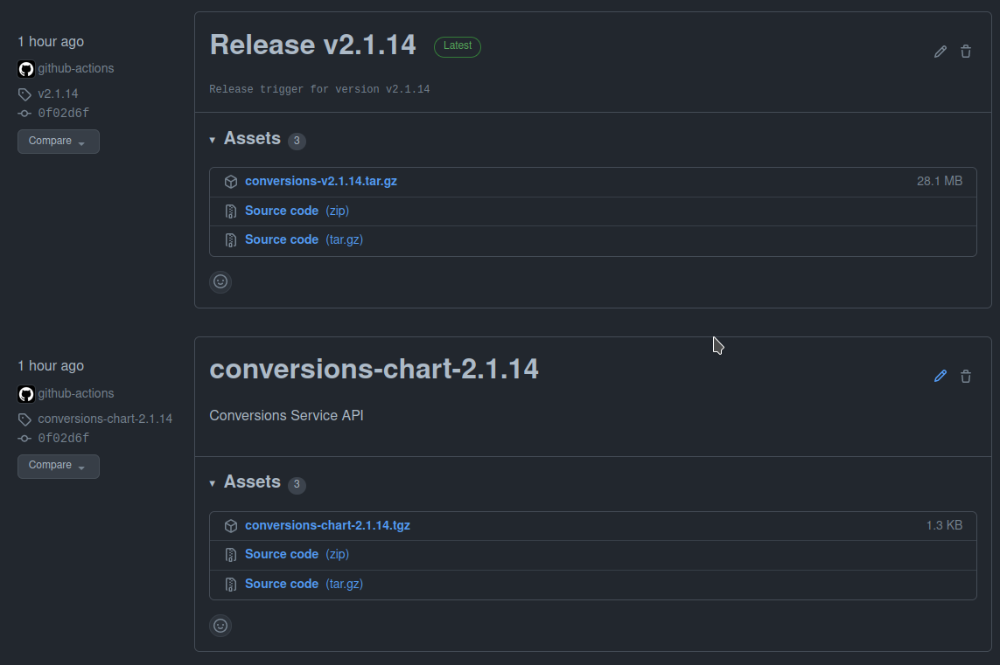
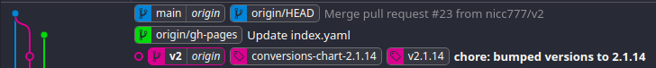

# Chapter 09 - HELM Charts and package management for Kubernetes

- [Chapter 09 - HELM Charts and package management for Kubernetes](#chapter-09---helm-charts-and-package-management-for-kubernetes)
  - [Why Package Management?](#why-package-management)
  - [What is Helm?](#what-is-helm)
  - [Installing the Helm Client](#installing-the-helm-client)
  - [Deploying a Chart to a Kubernetes Cluster](#deploying-a-chart-to-a-kubernetes-cluster)
  - [Creating a Custom Chart](#creating-a-custom-chart)
  - [Hosting Charts & Adjusting Build Pipelines to Update Charts with New Releases](#hosting-charts--adjusting-build-pipelines-to-update-charts-with-new-releases)
  - [Deploying the Conversion Service using Helm](#deploying-the-conversion-service-using-helm)
  - [Conclusion](#conclusion)

## Why Package Management?

You may often think about installing apps from an app store on you mobile device when you think of an example, but it is actually a little more complex than that when it comes to software systems.

Therefore, I prefer to rather use the various Linux package management solutions, like the debian package manager or the Red Hat package manager, as better examples. The reason why these are better examples lie in the more complex features of these package managers, like the ability to add dependencies to a package.

When you install a package on a Linux system, all dependencies not already installed will also be installed. After installation, each of these packages may be independently configured. The default configuration, often with files in `/etc`, are set-up to support a wide variety of use cases, as one package (like the Apache web server), may be used as a dependency is many other packages that require a web server. For example, on my Ubuntu 20.04 system, when I run a command like `sudo apt-rdepends -r apache2`, I notice a total of 471 other packages that depend on `apache2` (for example, `wordpress`). 

This is where package management as well as the actual package maintenance becomes interesting: package maintainers have to consider how other package will use their packaged applications. For example, each package that depends on the Apache web server may need to include their own specific configuration. The Apache configuration system supports this feature by providing the ability for independent packages to add their specific configuration in a directory and Apache will import all the individual configurations from that directory when it starts up. Of course you, as the user, can still fine tune each applications configuration to suite your needs and you can even further modify the other Apache configuration files as required.

Enter Kubernetes and Helm...

When you develop an application for Kubernetes, you may end up also depending on another application - for example a database. Based on accepted microservices best practices, you could decide on a strategy to deploy a separate database (like PostgreSQL) with your application. In this scenario, our application will run in the Kubernetes cluster with it's own database instances also deployed in the same cluster. 

_*Note*_: There are various aspects you need to consider before deploying databases in a cluster. There is a good argument why you may still use database resources outside the cluster, although you may also have to think about how you maintain service boundaries in a more centralized database setup. This debate, although interesting, is not in the scope of this guide, and I will therefore use this purely as an example of what is possible. You and your team have to decide on the correct approach for your services. Also note that in Public Cloud environments like AWS, it may be a much better options to consider using a [DBaaS, like RDS](https://aws.amazon.com/rds/), which will give you a highly available and elastic database service managed by the cloud provider.

## What is Helm?

Helm provides us with a way to package our services for deployment in a Kubernetes cluster along with any other dependencies and complex configuration that may be required.

In your application you will typically also maintain a Helm chart that is also exposed on a repository. By running a special `helm` command on your system, you can deploy packages from various repositories into your cluster. It is very similar to a Linux package manager in that regard.

Below is a quick illustration of how Helm fits into a typical environment:

<a href="https://github.com/nicc777/kubernetes-from-scratch/raw/main/chapter_09/helm-01.png" target="_blank"></a>

## Installing the Helm Client

Helm support many operating systems and environment and their installation instructions [are well documented](https://helm.sh/docs/intro/install/)

Since I'm using an Ubuntu system, I followed the [From Apt (Debian/Ubuntu)](https://helm.sh/docs/intro/install/#from-apt-debianubuntu) instructions:

```shell
curl https://baltocdn.com/helm/signing.asc | sudo apt-key add -
sudo apt-get install apt-transport-https --yes
echo "deb https://baltocdn.com/helm/stable/debian/ all main" | sudo tee /etc/apt/sources.list.d/helm-stable-debian.list
sudo apt-get update
sudo apt-get install helm
```

I just used a package manager to install a package manager!

Next is some optional housekeeping - adding command completion to `zsh` (consult [the documentation](https://helm.sh/docs/helm/helm_completion/) for other shell):

```shell
helm completion zsh > ~/.helmrc; echo "source ~/.helmrc" >> ~/.zshrc
```

When the command is completed, also run `source ~/.zshrc` to reload your rc file.

## Deploying a Chart to a Kubernetes Cluster

Earlier in chapter 02 we tested PostgreSQL docker image. Lets try something similar with `Helm` and install a PostgreSQL server in our cluster.

First, if you have not already done so, add the repo:

```shell
helm repo add bitnami https://charts.bitnami.com/bitnami
```

Then, make sure out local info is up to date:

```shell
helm repo update
```

A quick search with `helm search repo bitnami | grep post` will yield something along the following results:

```text
bitnami/postgresql                              10.7.1          11.12.0         Chart for PostgreSQL, an object-relational data...
bitnami/postgresql-ha                           7.8.2           11.12.0         Chart for PostgreSQL with HA architecture (usin...
```

Obviously there are some configuration we need to apply, for example the PostgreSQL user password. To see all the values that cen be set, use the command `helm show values bitnami/postgresql-ha`.

Lets install a PostgreSQL Cluster:

```shell
helm install \
--set global.postgresql.username=dbadmin \
--set global.postgresql.password=password \
--set persistence.enabled=false \
test-db bitnami/postgresql-ha
```

The deployment may take a minute or two depending on your Internet bandwidth as the container images must be downloaded (if not previously downloaded and still in cache). Once the containers are downloaded, the entire startup process takes less than a minute.

Check the status:

```shell
helm status test-db
```

The output may look something like this:

```text
NAME: test-db
LAST DEPLOYED: Tue Aug  3 06:34:24 2021
NAMESPACE: pocs
STATUS: deployed
REVISION: 1
TEST SUITE: None
NOTES:
** Please be patient while the chart is being deployed **
PostgreSQL can be accessed through Pgpool via port 5432 on the following DNS name from within your cluster:

    test-db-postgresql-ha-pgpool.pocs.svc.cluster.local

Pgpool acts as a load balancer for PostgreSQL and forward read/write connections to the primary node while read-only connections are forwarded to standby nodes.

To get the password for "dbadmin" run:

    export POSTGRES_PASSWORD=$(kubectl get secret --namespace pocs test-db-postgresql-ha-postgresql -o jsonpath="{.data.postgresql-password}" | base64 --decode)

To get the password for "repmgr" run:

    export REPMGR_PASSWORD=$(kubectl get secret --namespace pocs test-db-postgresql-ha-postgresql -o jsonpath="{.data.repmgr-password}" | base64 --decode)

To connect to your database run the following command:

    kubectl run test-db-postgresql-ha-client --rm --tty -i --restart='Never' --namespace pocs --image docker.io/bitnami/postgresql-repmgr:11.12.0-debian-10-r44 --env="PGPASSWORD=$POSTGRES_PASSWORD"  \
        --command -- psql -h test-db-postgresql-ha-pgpool -p 5432 -U dbadmin -d postgres

To connect to your database from outside the cluster execute the following commands:

    kubectl port-forward --namespace pocs svc/test-db-postgresql-ha-pgpool 5432:5432 &
    psql -h 127.0.0.1 -p 5432 -U dbadmin -d postgres
```

Let's connect to the DB to test:

```shell
export POSTGRES_PASSWORD=$(kubectl get secret --namespace pocs test-db-postgresql-ha-postgresql -o jsonpath="{.data.postgresql-password}" | base64 --decode)

kubectl run test-db-postgresql-ha-client --rm --tty -i --restart='Never' \
--namespace pocs --image docker.io/bitnami/postgresql-repmgr:11.12.0-debian-10-r44 \
--env="PGPASSWORD=$POSTGRES_PASSWORD"  --command -- \
psql -h test-db-postgresql-ha-pgpool -p 5432 -U dbadmin -d postgres
```

The above command should present you with a PostgreSQL prompt from where you can run SQL or PostgreSQL commands.

In this very quick example we were able to deploy PostgreSQL in a High-Availability configuration. That was pretty easy compared to doing it manually on dedicated servers! However, keep in mind that this example should not be used in production as we specifically did not configure persistent storage. Any data you add to the databases will be permanently lost of you delete the chart.

To delete the chart when you are done testing:

```shell
helm delete test-db
```

References:

* Full instructions for this particular chart is available [on GitHub](https://github.com/bitnami/charts/tree/master/bitnami/postgresql-ha)

## Creating a Custom Chart

A new chart can be created with a command like `helm create conversions-chart`. In the `java-conversions-app`, I created a new branch called `helm-test` from the `v2` branch tagged `v2.0.5`. I will keep this branch for reference, but ultimately it will be merged into the `v2` branch and be used from that point forward.

When the `create` command was run, the following directories and files were created:

```text
conversions-chart
├── charts
├── Chart.yaml
├── templates
│   ├── deployment.yaml
│   ├── _helpers.tpl
│   ├── hpa.yaml
│   ├── ingress.yaml
│   ├── NOTES.txt
│   ├── serviceaccount.yaml
│   ├── service.yaml
│   └── tests
│       └── test-connection.yaml
└── values.yaml
```

However, since I wanted to start from scratch, I deleted all the existing files with the command `rm -vf conversions-chart/templates/* conversions-chart/templates/tests/*`

The updated files are available in the [java-conversions-app, branch `v2-helm`](https://github.com/nicc777/java-conversions-app/tree/v2-helm) for reference.

At any stage, if I wanted to test the configuration without actually installing anything, I would do a dry-run like this:

```shell
helm install --debug --dry-run simple-test conversions-chart
```

_*Note*_: Helm files can contain objects (variables). In the above example, the release name object `simple-test` can be referenced using the following reference in templates: `{{ .Release.Name }}`

Add the repo:

```shell
helm repo add java-conversions-app https://nicc777.github.io/java-conversions-app

helm repo update
```

You should now see the package with the command `helm search repo java-conversions-app` that will produce output similar to the following:

```text
NAME                                    CHART VERSION   APP VERSION     DESCRIPTION
java-conversions-app/conversions-chart  2.1.14          2.1.14          Conversions Service API
```

_*Note*_: The chart version and app version doesn't have to be the same, but I decided to synchronize them for this particular project.

To install the newly added package run:

```shell
helm install test-conversions java-conversions-app/conversions-chart
```

The output may look something like the following:

```text
NAME: test-conversions
LAST DEPLOYED: Fri Aug  6 06:08:44 2021
NAMESPACE: pocs
STATUS: deployed
REVISION: 1
TEST SUITE: None
NOTES:
Thank you for installing conversions-chart.

Your release is named test-conversions.

To learn more about the release, try:

  $ helm status test-conversions
  $ helm get all test-conversions
```

As with the previous chapter, you can still test the service:

```shell
curl -X 'POST' \
'http://k8s-dev:8000/dev/conversions/v2/convert' \
-H 'accept: */*' \
-H 'Content-Type: application/json' \
-d '{
"sourceUnit": "Fahrenheit",
"destinationUnit": "Celsius",
"value": "59"
}'
```

_+Note*_: The `k8s-dev` hostname is defined in my `/etc/hosts` file and points to my dev server (physical tin - LAN IP address). Adjust to fit your environment.

References:

* [Built-in Objects](https://helm.sh/docs/chart_template_guide/builtin_objects/) - objects in this context is what you may also call variables that can be referenced.
* [Values file](https://helm.sh/docs/chart_template_guide/values_files/) - Where values can be defined that are referenced with `{{ .Values.*** }}`
* [Template Function List](https://helm.sh/docs/chart_template_guide/function_list/)
* [Flow Control](https://helm.sh/docs/chart_template_guide/control_structures/)
* [Variables](https://helm.sh/docs/chart_template_guide/variables/)

## Hosting Charts & Adjusting Build Pipelines to Update Charts with New Releases

This section is only applicable if you intend to use GitHub [Actions](https://github.com/features/actions). Similar concepts exists in other environments, but the implementations are different - you will have to consult your technology stack's documentation for details.

Hosting a Helm Chart in GitHub is a bit tricky and it took me a couple of attempts to get it right. In fact, I don't really like the current implementation that much, but I decided to stick with it for now.

In the `java-conversions-app` project, the Helm release is defined in the file `.github/workflows/build-project.yml`, and more specifically the following snippet:

```yaml
      - name: Run chart-releaser
        uses: helm/chart-releaser-action@v1.2.1
        with:
          charts_dir: charts
        env:
          CR_TOKEN: "${{ secrets.GITHUB_TOKEN }}"
```

As you can see, this project relies on the [`helm/chart-releaser-action`](https://github.com/helm/chart-releaser-action) GitHub Action.

When the action is triggered, this step will create a new Helm release *if* the chart version in `Chart.yaml` has been updated.

When the Helm release is created, it will use the "special" branch called `gh-pages` to create/update the `index.yaml` file which contains the information required by Helm. You don't ever have to manually edit this file, but out of interest, it is listed below:

```yaml
apiVersion: v1
entries:
  conversions-chart:
  - apiVersion: v2
    appVersion: 2.1.14
    created: "2021-10-31T08:43:34.191706161Z"
    description: Conversions Service API
    digest: 4442c76d5ea2bc15eb07c7d80a4e0d4f18b7fb2f84d3e0441965471289e30d24
    name: conversions-chart
    type: application
    urls:
    - https://github.com/nicc777/java-conversions-app/releases/download/conversions-chart-2.1.14/conversions-chart-2.1.14.tgz
    version: 2.1.14
  - apiVersion: v2
    appVersion: 2.1.6
    created: "2021-08-06T04:20:04.195217073Z"
    description: Conversions Service API
    digest: 2f0b97fbfa3083510dd7a6b62b1deebe5bceca32ba1cf36d01da50534aad8d3f
    name: conversions-chart
    type: application
    urls:
    - https://github.com/nicc777/java-conversions-app/releases/download/conversions-chart-0.1.13/conversions-chart-0.1.13.tgz
    version: 0.1.13
  - apiVersion: v2
    appVersion: 2.1.8
    created: "2021-08-06T04:15:11.670148462Z"
    description: Conversions Service API
    digest: aeaee3ee841929bd2e3b6c263db60e4cae328c9702b95e3690b44da99725fa27
    name: conversions-chart
    type: application
    urls:
    - https://github.com/nicc777/java-conversions-app/releases/download/conversions-chart-0.1.12/conversions-chart-0.1.12.tgz
    version: 0.1.12
  - apiVersion: v2
    appVersion: 2.1.8
    created: "2021-08-06T03:51:58.449303727Z"
    description: Conversions Service API
    digest: 11ab079ff461429c7a92ddf1cd384a5e522bf9afb350190fcea4dc10142ba2ec
    name: conversions-chart
    type: application
    urls:
    - https://github.com/nicc777/java-conversions-app/releases/download/conversions-chart-0.1.11/conversions-chart-0.1.11.tgz
    version: 0.1.11
generated: "2021-10-31T08:43:34.191733061Z"
```

You may notice that the Helm release points to an actual release, as can be seen from the screenshot below:



The typical workflow is documented in the `java-conversions-app` project. A typical release will result in a Git graph similar to the following (I always merge to the `main` branch after the release of the latest version, for this particular workflow):



_*Note*_: The `gh-pages` branch is never merged to main. It will be maintained by the relevant action, so you don't have to worry about it.

References:

* [`java-conversions-app` projec](https://github.com/nicc777/java-conversions-app)

## Deploying the Conversion Service using Helm

TODO

## Conclusion

TODO


